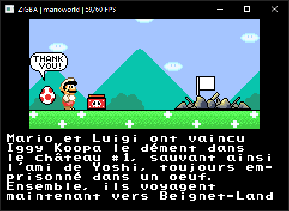
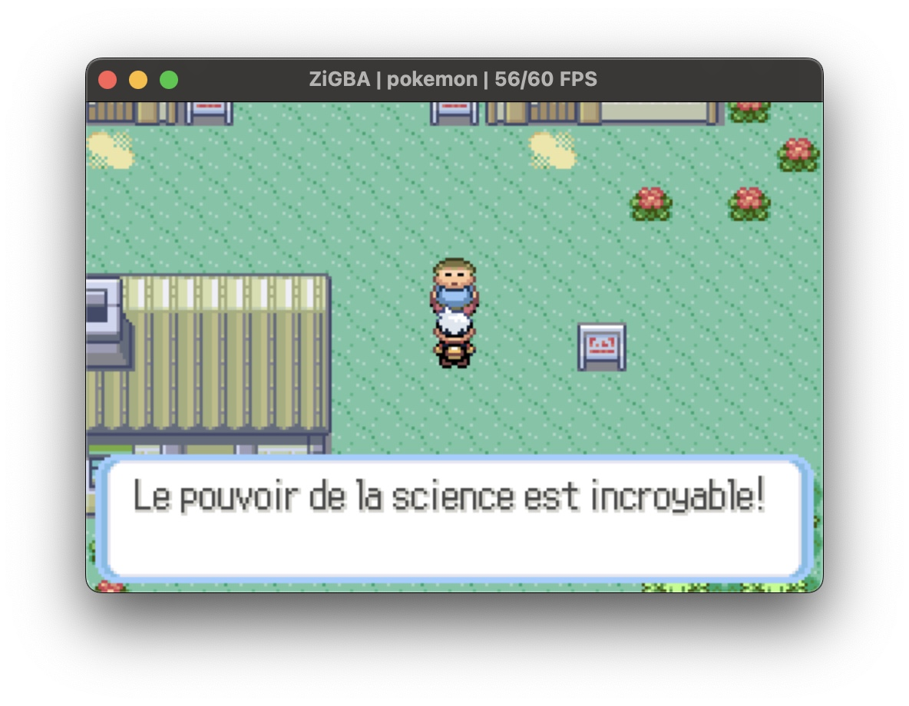
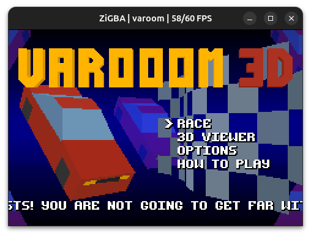

<div style="text-align: center;object-fit: cover;width: 100%;height: 300px;">
    
    
    
</div>

<details>
    <summary>Test</summary>

| Suite / Catégorie de test | Résultat | Statut |
| :--- | :---: | :---: |
| **[AGS Aging Cartridge](https://tcrf.net/AGS_Aging_Cartridge)** | - | Good |
| **[GBA Suite](https://github.com/mgba-emu/suite/tree/master)** | | |
| Memory tests | 1552 / 1552 | Good |
| I/O read tests | 130 / 130 | Good |
| Timing Test | 2020 / 2020 | Good |
| Timer count-up tests | 936 / 936 | Good |
| Timer IRQ tests | 90 / 90 | Good |
| Shifter tests | 140 / 140 | Good |
| Carry tests | 93 / 93 | Good |
| Multiply long tests | 72 / 72 | Good |
| Bios math tests | 615 / 615 | Good |
| DMA tests | 1256 / 1256 | Good |
| SIO register R/W tests | 90 / 90 | Good |
| SIO timing tests | 4 / 4 | Good |
| Misc. edge case tests | 2 / 10 | Fail |

</div>
</details>

<details>
    <summary>Utilisation</summary>
    
Copiez bios.bin dans le dossier «system».

Puis lancez l'émulateur : ./ZiGBA votre_jeu.gba (--boot-bios est facultatif).

| Action GBA | Touche Clavier | Bouton Manette |
| :--- | :--- | :--- |
| Bouton A | X | Bouton Est/Droit |
| Bouton B | Z | Bouton Sud/Bas |
| Bouton L (Gâchette) | A | Gâchette Gauche (L / LB) ou Trigger Gauche |
| Bouton R (Gâchette) | S | Gâchette Droite (R / RB) ou Trigger Droit |
| START | Entrée | Bouton Menu / Start |
| SELECT | Retour Arrière | Bouton Share / Back / Select |
| Direction | Flèches | Croix directionnelle (D-Pad) ou Stick Gauche |


| Raccourci | Action |
| :--- | :--- |
| Espace / Ctrl+P | Pause / Reprise de l'émulation |
| Ctrl + S | Save state |
| Ctrl + L | Charger la save state |
| Échap | Quitter l'application |

</div>
</details>

<details>
<summary>Compilation</summary>
<div style="text-align: center;object-fit: cover;width: 100%;height: 500px;">
Nécessite Zig 0.16.0 & SDL3 pour la compilation.

Windows (statique):

```bash
zig build-exe src\main.zig -O ReleaseFast -fstrip -fsingle-threaded -target x86_64-windows-gnu -I "YOUR_FOLDER\SDL\include" "YOUR_FOLDER\SDL\build\libSDL3.a" -luser32 -lgdi32 -lwinmm -limm32 -lole32 -loleaut32 -lversion -luuid -ladvapi32 -lsetupapi -lshell32 -lcfgmgr32 -lhid -femit-bin="ZiGBA.exe"
```

Nécessite quelques ajustements pour être compilé avec MSVC.

Linux (statique) :

```bash
zig build-exe src/main.zig -O ReleaseFast -fstrip -fsingle-threaded -I "YOUR_FOLDER/SDL3-3.4.4-build/SDL3-3.4.4/include" "YOUR_FOLDER/SDL3-3.4.4-build/SDL3-3.4.4/build/libSDL3.a" -lc -lm -lpthread -lrt -lX11 -lXext -lXcursor -lXi -lXrandr -lwayland-client -lwayland-cursor -lwayland-egl -lxkbcommon -lasound -lpulse -femit-bin="ZiGBA"
```

MacOS (dynamique) : 

```bash
zig build-exe src/main.zig -O ReleaseFast -lc -fstrip -F /Library/Frameworks -framework SDL3 -rpath /Library/Frameworks -femit-bin="ZiGBA"
```

</div>
</details>
